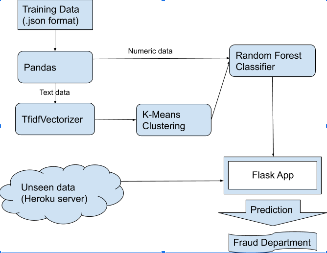
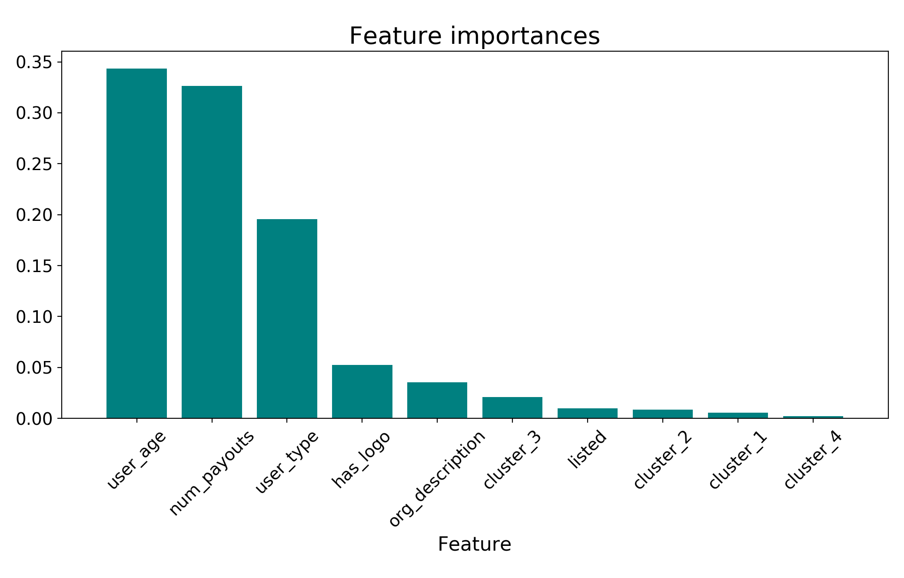

# Fraud Case Study

       

## Problem Statement

We have been tasked with identifying fraudulent events based on data provided to us by an online event planning company.  Since out product will be identifying potential fraud for further investigation, as opposed to automatically taking down 'fraud' events, we expect that the best approach will be to minimize false negatives.  The business is better suited by a product that is overly cautious in its initial screen, allowing the human agents to make final decision based on their experience or, perhaps less often, contact with the customer.

## Data

The training data came in json format, with 14,337 rows and 44 features.  The features contained a lot of information, but not all of it appeared to be helpful in identifying fraud.  We removed data that had been collected over time since each event's publication (such as ticket sales), as our goal was to use only information immediately available.

Some cursory EDA revealed that many of the features were simply not relevent to the occurance of fraud, i.e. they occurred at the same rate or with similar values across fraud and non-fraud events.

In the end, we stuck with 8 features that appeared to be important to predicting fruadulent events:

`['has_logo', 'listed', 'num_payouts', 'user_age', 'user_type', 'org_description', 'name', 'event_description']`
 
We altered org_description so that it simply indicated the existance of an organization description, figuring that a lack of description might be more likely for fruadulent events.  The rest of the features were analyzes as is.

It is important to note that the classes in this dataset were severely imbalanced, only about 9% of the rows were members of the positive class. Our first step towards mitigate the effects of this was stratifying the train_test_split.  Additional steps are discussed below in the model selection section.

## Pipeline

       

### Training Data

### Test Data

## Model Selection and Improvement

Literature on the subject indicated that a standard Logistic Regression might perform well in this scenario.  We ran this model with standard hyperparameters and got the following results:
#### 500 Sample subset

| Scoring Metric | Train Score |
|----------------|-------------|
| Accuracy       | 0.92        |
| Recall         | 0.30        |
| F1-score       | 0.42        |

Given the class imbalance, this high-accuracy, poor-recall model is not all that much of a shock.

#### 500 Sample subset
with class_weights='balanced'
| Scoring Metric | Train Score | Test Score |
|----------------|-------------|------------|
| Accuracy       | 0.81        | 0.82
| Recall         | 0.85        | 0.82
| F1-score       | 0.44        | 0.45
| Precision      | 0.29        | 0.31

#### Full Dataset
| Scoring Metric | Train Score | Test Score |
|----------------|-------------|------------|
| Accuracy       | 0.78        | 0.78       |
| Recall         | 0.85        | 0.84       |
| F1-score       | 0.41        | 0.40       |
| Precision      | 0.27        | 0.27       |

to improve this model: oversample, undersample, SMOTE, 

We also wanted to give a non-linear model a shot, so we put together a Random Forest.  

#### 500 Sample subset
| Scoring Metric | Train Score | Test Score |
|----------------|-------------|------------|
| Accuracy       | 0.96        | 0.90       |
| Recall         | 0.97        | 0.64       |
| F1-score       | 0.83        | 0.54       |
| Precision      | 0.73        | 0.47       |

#### Full Dataset
| Scoring Metric | Train Score | Test Score |
|----------------|-------------|------------|
| Accuracy       | 0.83        | 0.79       |
| Recall         | 0.92        | 0.88       |
| F1-score       | 0.50        | 0.49       |
| Precision      | 0.34        | 0.34       |

       

## Flask Implementation

## Results

Header image credit: https://paymentdepot.com/wp-content/uploads/2018/12/5-Types-of-Retail-Fraud-and-How-to-Prevent-Them1-1024x683.jpg